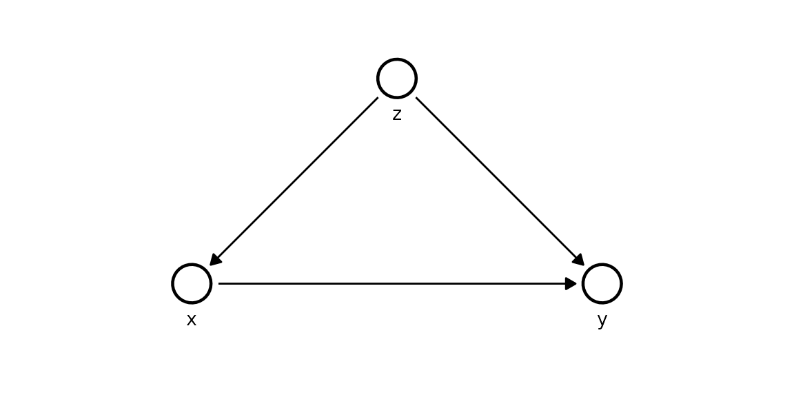
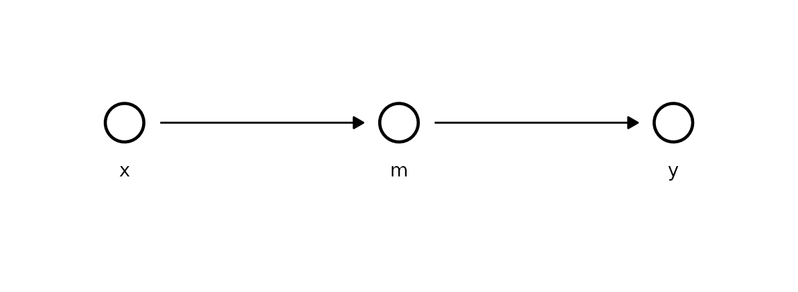
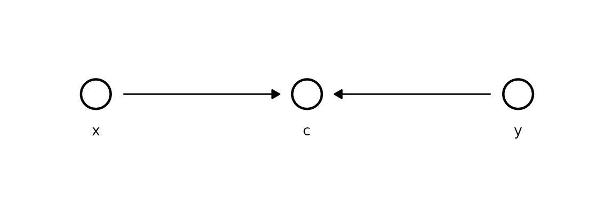
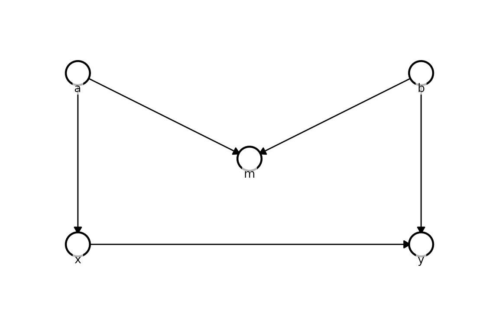
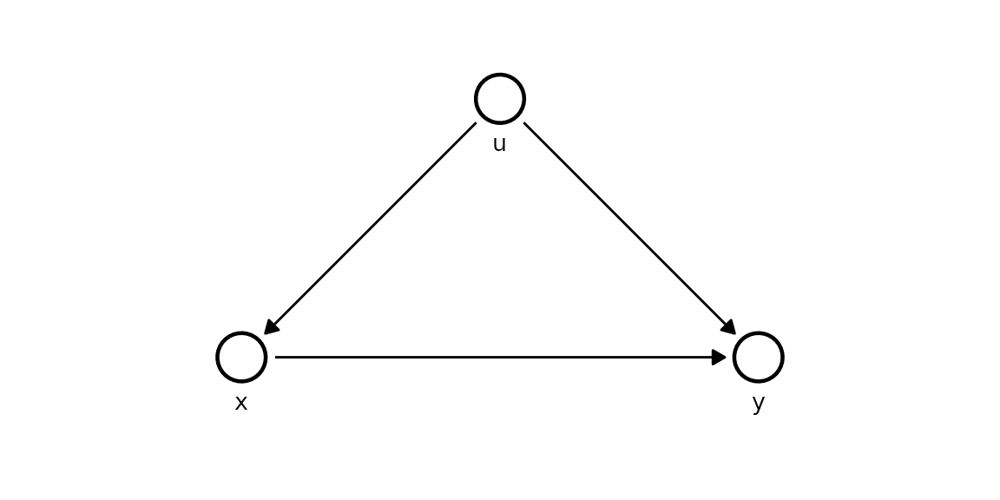

# Causal structures: confounder, mediator, collider, M-bias

This vignette compares naive OLS against Kagu’s do-calculus estimates on
four canonical graph structures where conditioning on the wrong set of
variables leads to bias - and a fifth where *nothing* works, to show the
method’s limits.

**How to read each section.** For every structure we print two ordinary
least-squares estimates of the `x → y` coefficient - one *naive*
(`y ~ x`) and one *adjusted* (`y ~ x + ...`) - then Kagu’s
interventional estimate as a tidy table. In that table `mean` is the
posterior mean effect and `hdi_lower`/`hdi_upper` bound the 90% highest
density interval (the range containing 90% of the posterior
probability - the credible values). The lesson each time: OLS is right
only with the *correct* adjustment set, which you can only know from the
causal structure; Kagu reads that structure off the DAG and applies the
do-operator directly.

------------------------------------------------------------------------

## 1 - Confounder

    z → x → y
    z → y

The confounder `z` causes both `x` and `y`. Naive OLS of `y ~ x` without
adjusting for `z` is biased; Kagu uses the full structural model.

True effect of `x` on `y`: **+1.5**.

``` r

z <- rnorm(N)
x <- 1.0 * z + rnorm(N, sd = 0.5)
y <- 1.5 * x + 1.0 * z + rnorm(N, sd = 0.5)
df_confounder <- data.frame(z = z, x = x, y = y)
```

``` r

cat("OLS (naive):   ", coef(lm(y ~ x, df_confounder))[["x"]], "\n")
#> OLS (naive):    2.297737
cat("OLS (adjusted):", coef(lm(y ~ x + z, df_confounder))[["x"]], "\n")
#> OLS (adjusted): 1.500995
```

``` r

model_confounder <- KaguModel$new(dag = list(z = c(), x = c("z"), y = c("x", "z")))
model_confounder$fit(df_confounder)
```

``` r

model_confounder$plot_dag(node_pos = list(
  z = c(0, 0), x = c(1, -1), y = c(1, 1)
))
```



``` r

model_confounder$effects("x", "y", values = c(0, 1))$summary()
#> # A tibble: 1 × 8
#>   source target  from    to  mean     sd hdi_lower hdi_upper
#>   <chr>  <chr>  <dbl> <dbl> <dbl>  <dbl>     <dbl>     <dbl>
#> 1 x      y          0     1  1.51 0.0463      1.43      1.58
```

Notice the naive OLS estimate sits well above 1.5 - the confounding path
`x ← z → y` leaks association into the slope. The *adjusted* OLS is
correct here only because we happened to condition on `z`. Kagu’s table
recovers ≈ 1.5 with a 90% HDI comfortably around the truth, because the
structural model represents `z` as a common cause and the do-operator
severs the incoming edge to `x`.

------------------------------------------------------------------------

## 2 - Mediator

    x → m → y

The mediator `m` lies on the causal path. Naive OLS of `y ~ x + m`
blocks the path and gives a biased (near-zero) estimate of the total
effect.

True total effect of `x` on `y`: **−1.6** (= 0.8 × −2).

``` r

x <- rnorm(N)
m <- 0.8 * x + rnorm(N, sd = 0.5)
y <- -2.0 * m + rnorm(N, sd = 0.5)
df_mediator <- data.frame(x = x, m = m, y = y)
```

``` r

cat("OLS (naive):   ", coef(lm(y ~ x, df_mediator))[["x"]], "\n")
#> OLS (naive):    -1.610851
cat("OLS (adjusted):", coef(lm(y ~ x + m, df_mediator))[["x"]], "\n")
#> OLS (adjusted): 0.02841504
```

``` r

model_mediator <- KaguModel$new(dag = list(x = c(), m = c("x"), y = c("m")))
model_mediator$fit(df_mediator)
```

``` r

model_mediator$plot_dag(node_pos = list(
  x = c(0, 0), m = c(0, 1), y = c(0, 2)
))
```



``` r

model_mediator$effects("x", "y", values = c(0, 1))$summary()
#> # A tibble: 1 × 8
#>   source target  from    to  mean     sd hdi_lower hdi_upper
#>   <chr>  <chr>  <dbl> <dbl> <dbl>  <dbl>     <dbl>     <dbl>
#> 1 x      y          0     1 -1.65 0.0598     -1.76     -1.56
```

Here the roles flip: *naive* OLS is correct and *adjusted* OLS is
biased. Adding `m` to the regression conditions on the mediator and
blocks the very path the effect travels along, collapsing the estimate
toward zero. Kagu propagates through `m` automatically, so its table
recovers the total effect ≈ −1.6 - you never have to reason about which
covariates to include.

------------------------------------------------------------------------

## 3 - Collider

    x → c ← y

The collider `c` has two causes. `x` and `y` are independent - the true
effect of `x` on `y` is **0**. Conditioning on `c` opens a spurious path
and induces bias.

``` r

x <- rnorm(N)
y <- rnorm(N)
c <- 0.7 * x + 0.7 * y + rnorm(N, sd = 0.5)
df_collider <- data.frame(x = x, y = y, c = c)
```

``` r

cat("OLS (naive):   ", coef(lm(y ~ x, df_collider))[["x"]], "\n")
#> OLS (naive):    -0.03820014
cat("OLS (adjusted):", coef(lm(y ~ x + c, df_collider))[["x"]], "\n")
#> OLS (adjusted): -0.6685109
```

``` r

model_collider <- KaguModel$new(dag = list(x = c(), y = c(), c = c("x", "y")))
model_collider$fit(df_collider)
```

``` r

model_collider$plot_dag(node_pos = list(
  x = c(0, 0), c = c(0, 1), y = c(0, 2)
))
```



``` r

model_collider$effects("x", "y")$summary()
#> # A tibble: 1 × 8
#>   source target  from    to  mean    sd hdi_lower hdi_upper
#>   <chr>  <chr>  <dbl> <dbl> <dbl> <dbl>     <dbl>     <dbl>
#> 1 x      y          0     0     0     0         0         0
```

Naive OLS is correct (≈ 0), but adjusting for the collider `c` induces a
spurious association - conditioning on a common effect makes its causes
appear related. Kagu returns an effect whose HDI straddles zero, because
`x` has no directed path to `y` in the DAG and the propagation simply
finds nothing to carry.

------------------------------------------------------------------------

## 4 - M-bias

    a → x    b → y
    a → m ← b

`m` is a collider on a non-causal path. The true effect of `x` on `y` is
**+1.0**. Conditioning on `m` opens a spurious path via `a` and `b`,
biasing a naive adjusted OLS estimate.

``` r

a <- rnorm(N)
b <- rnorm(N)
x <- 1.0 * a + rnorm(N, sd = 0.5)
y <- 1.0 * x + 1.0 * b + rnorm(N, sd = 0.5)
m <- 0.7 * a + 0.7 * b + rnorm(N, sd = 0.5)
df_mbias <- data.frame(a = a, b = b, x = x, y = y, m = m)
```

``` r

cat("OLS (naive):   ", coef(lm(y ~ x, df_mbias))[["x"]], "\n")
#> OLS (naive):    0.9261762
cat("OLS (adjusted):", coef(lm(y ~ x + m, df_mbias))[["x"]], "\n")
#> OLS (adjusted): 0.4620789
```

``` r

model_mbias <- KaguModel$new(dag = list(
  a = c(), b = c(),
  x = c("a"), y = c("x", "b"),
  m = c("a", "b")
))
model_mbias$fit(df_mbias)
```

``` r

model_mbias$plot_dag(node_pos = list(
  a = c(0, -2), b = c(0, 2),
  m = c(1,  0),
  x = c(2, -2), y = c(2, 2)
))
```



``` r

model_mbias$effects("x", "y", values = c(0, 1))$summary()
#> # A tibble: 1 × 8
#>   source target  from    to  mean     sd hdi_lower hdi_upper
#>   <chr>  <chr>  <dbl> <dbl> <dbl>  <dbl>     <dbl>     <dbl>
#> 1 x      y          0     1  1.02 0.0233     0.979      1.06
```

M-bias is the subtle one: `m` is a *pre-treatment* collider, so the
usual instinct to “adjust for everything measured beforehand” backfires.
Adjusted OLS opens the path `x ← a → m ← b → y` and biases the estimate,
while naive OLS (≈ 1.0) is fine. Kagu, working from the correct
structural model, never adjusts for `m` during propagation and its table
recovers ≈ 1.0.

------------------------------------------------------------------------

## 5 - Latent confounder (where everything fails)

    u → x → y
    u → y       (u is unobserved)

So far the structural model has always won. This example shows where it
*cannot*, and why that is the honest answer rather than a shortcoming.
The common cause `u` is now **latent** - it drives both `x` and `y` but
is never recorded. The true direct effect of `x` on `y` is **+1.5**.

The structure we *wish* we could fit - `u` is the unobserved common
cause:

``` r

kagu_plot_dag(
  list(u = c(), x = c("u"), y = c("x", "u")),
  node_pos = list(u = c(0, 0), x = c(1, -1), y = c(1, 1))
)
```



``` r

u <- rnorm(N)                          # the hidden confounder
x <- 1.0 * u + rnorm(N, sd = 0.5)
y <- 1.5 * x + 1.0 * u + rnorm(N, sd = 0.5)
df_latent <- data.frame(x = x, y = y)  # u is NOT included
```

With only `x` and `y` recorded, the only regression we can run is the
naive one - there is no `u` column to adjust for:

``` r

cat("OLS (naive):   ", coef(lm(y ~ x, df_latent))[["x"]], "\n")
#> OLS (naive):    2.275413
cat("OLS (adjusted): unavailable - 'u' is not measured\n")
#> OLS (adjusted): unavailable - 'u' is not measured
```

The naive slope is biased upward, exactly as in the confounder example -
but this time there is no adjustment available to repair it.

Can the structural model rescue us? Only if we can supply the
confounder. Writing the *correct* DAG and asking Kagu to fit it fails
fast, by design:

``` r

model_latent <- KaguModel$new(dag = list(u = c(), x = c("u"), y = c("x", "u")))
model_latent$fit(df_latent)
#> Error in `.check_data_nodes()`:
#> ! DAG node "u" is not present in `data`.
#> ℹ If this variable was simply left out, add it as a column and re-fit.
#> ! If it is latent - an unmeasured common cause, for instance - Kagu cannot
#>   estimate its mechanism, because there are no observations to condition on.
#> ℹ Unobserved confounding biases every effect that flows through the missing
#>   node, and no amount of modelling recovers it from the data alone. Where a
#>   confounder is truly latent, establish that your target effect is identifiable
#>   (e.g. via an instrument, a valid adjustment set, or a front-door path) before
#>   trusting the estimates.
```

Kagu refuses to invent data for an unmeasured node, and the message
spells out the consequence. The alternative is to drop `u` from the DAG
so the model fits - but then it is structurally identical to the naive
regression, and just as biased:

``` r

model_latent_naive <- KaguModel$new(dag = list(x = c(), y = c("x")))
model_latent_naive$fit(df_latent)
```

``` r

model_latent_naive$effects("x", "y", values = c(0, 1))$summary()
#> # A tibble: 1 × 8
#>   source target  from    to  mean     sd hdi_lower hdi_upper
#>   <chr>  <chr>  <dbl> <dbl> <dbl>  <dbl>     <dbl>     <dbl>
#> 1 x      y          0     1  2.30 0.0307      2.24      2.34
```

The estimate lands near the inflated OLS value, not the true 1.5, and
the HDI does not cover it. This is the key lesson: **unobserved
confounding cannot be undone from the data alone.** Neither regression
nor a graphical model recovers the truth when a common cause is
missing - the effect is simply *not identifiable* from these variables.
The remedies all live outside the dataset: measure the confounder, find
a valid instrument, or exploit a front-door path.

------------------------------------------------------------------------

## Summary

| Structure         | True effect | OLS (naive) | OLS (adjusted) | Kagu              |
|-------------------|-------------|-------------|----------------|-------------------|
| Confounder        | +1.5        | Biased ↑    | Correct        | ✓ Correct         |
| Mediator          | −1.6        | Correct     | Biased ≈ 0     | ✓ Correct         |
| Collider          | 0.0         | Correct     | Biased ≠ 0     | ✓ Correct         |
| M-bias            | +1.0        | Correct     | Biased         | ✓ Correct         |
| Latent confounder | +1.5        | Biased ↑    | Unavailable    | ⚠ Stops and warns |

OLS is correct only when it happens to use the right adjustment set.
Kagu encodes the causal structure explicitly and applies the
do-operator - correct by design *whenever the effect is identifiable*.

**Read the last row as a safety feature, not a shortcoming.** No
method - regression or graphical - can recover an effect that the data
simply cannot identify; that is a property of the problem, not of the
tool. The difference is in *how each one behaves at that boundary*. OLS
hands back a confident, biased number with no hint that anything is
wrong. Kagu instead detects the unmeasured node, **stops before fitting,
and emits a clear warning** explaining why the estimate would be
untrustworthy and what to do about it (measure the confounder, find an
instrument, or use a front-door path). A loud, actionable error is
exactly what you want here - it turns a silent statistical trap into a
visible, fixable one.
