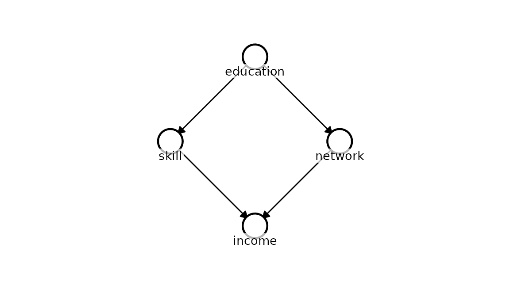
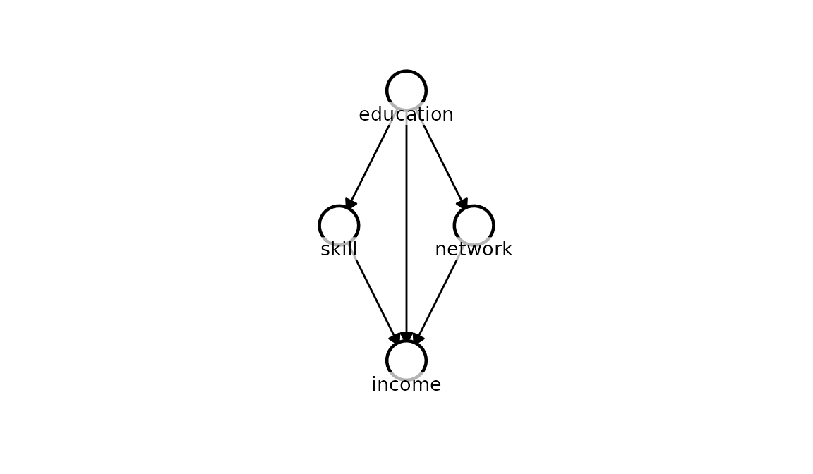
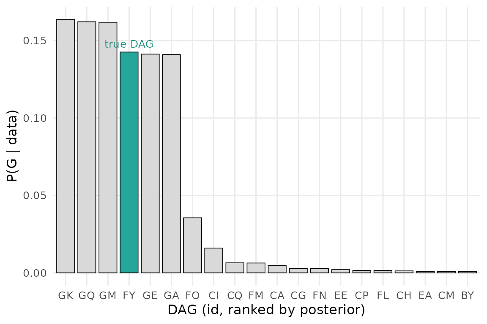

# Causal structure discovery

The other vignettes take the DAG as given. But the DAG is itself a
*hypothesis* about how a system works, and often it is exactly what we
want to learn. Kagu can treat structure discovery as Bayesian inference
over graphs: fit a GCM to every candidate DAG, and turn the marginal
likelihoods into a posterior distribution over structures,

``` math
P(G \mid X) \;\propto\; P(X \mid G)\, P(G).
```

Here $`P(X \mid G)`$ is the marginal likelihood of the data under graph
$`G`$ (computed in closed form from the per-node Gaussian-process fits)
and $`P(G)`$ is a prior over structures (currently uniform). Rather than
returning a single “best” graph, this returns a full probability
distribution - an honest representation of what the data can and cannot
tell us about causal structure.

## A worked example

We simulate a four-variable system with a known structure. `education`
is a root cause of both `skill` and `network`; `income` is driven by
`skill` and `network`. There is **no** direct `education → income` edge,
and `skill` and `network` are not directly linked.

``` r

true_dag <- list(
  education = c(),
  skill     = "education",
  network   = "education",
  income    = c("skill", "network")
)

kagu_plot_dag(true_dag, node_pos = list(
  education = c(0,  0),
  skill     = c(1, -1),
  network   = c(1,  1),
  income    = c(2,  0)
))
```



``` r

n         <- 50
education <- rnorm(n)
skill     <- 0.8 * education + rnorm(n, sd = 0.6)
network   <- 0.6 * education + rnorm(n, sd = 0.6)
income    <- 1.0 * skill + 0.7 * network + rnorm(n, sd = 0.6)

df <- data.frame(education, skill, network, income)
```

## Running the search

The number of DAGs grows explosively with the number of variables, so we
narrow the space with background knowledge. Here we know only that
`education` comes first - nothing causes a person’s education in this
system - so we use `disallowed` to forbid any edge pointing *into*
`education`. The ordering among `skill`, `network`, and `income` is left
for the data to resolve. This is exactly the kind of light domain
knowledge a researcher can bring to a problem.

``` r

disallowed <- list(
  c("skill",   "education"), 
  c("network", "education"), 
  c("income", "education")
)

result <- KaguModel$discover(df, disallowed = disallowed)
```

``` r

result
#> <DiscoveryResult: 199 DAGs, 25 unique local fits>
#> # A tibble: 5 × 5
#>    rank id    n_edges log_marglik posterior_prob
#>   <int> <chr>   <int>       <dbl>          <dbl>
#> 1     1 GK          5       -191.          0.164
#> 2     2 GQ          6       -191.          0.162
#> 3     3 GM          6       -191.          0.162
#> 4     4 FY          4       -191.          0.143
#> 5     5 GE          5       -191.          0.141
```

The search evaluated every DAG consistent with that constraint, but -
thanks to the Markov factorisation - only had to fit each unique
`node ~ parents` model once (far fewer fits than DAGs).

### Tighter constraints: `required` edges

For larger systems, the number of candidate DAGs can easily exceed
Kagu’s safety limits (capped at $`2^{24}`$ subsets, roughly 5
unconstrained nodes). If you have stronger structural beliefs-such as an
edge that absolutely *must* exist-you can pass `required`. This shrinks
the search space dramatically by removing those edges from the
combinatorics.

``` r

# Suppose we know education -> skill and education -> network are certain
result_req <- KaguModel$discover(
  df, 
  disallowed = disallowed, 
  required = list(c("education", "skill"), c("education", "network"))
)
```

### Explicit DAG comparison: `dags`

Sometimes you don’t want to search the whole graph space. If you have a
few specific, theoretically motivated hypotheses, you can pass them
directly via `dags`. Kagu will skip the combinatorial search entirely
and just compute the posterior probabilities over your explicit models.

``` r

dag_mediation <- list(education = c(), skill = "education", income = "skill")
dag_direct    <- list(education = c(), skill = c(), income = "education")

result_explicit <- KaguModel$discover(df, dags = list(dag_mediation, dag_direct))
```

## The posterior over DAGs

`$summary()` ranks the structures by posterior probability. Each row is
a whole DAG, referenced by a short `id` (here the enumerated graphs get
ids `"A"`, `"B"`, `"C"`, …; had we passed a *named* list of DAGs, those
names would be used instead). `posterior_prob` is $`P(G \mid X)`$.

``` r

result$summary()
#> # A tibble: 10 × 5
#>     rank id    n_edges log_marglik posterior_prob
#>    <int> <chr>   <int>       <dbl>          <dbl>
#>  1     1 GK          5       -191.        0.164  
#>  2     2 GQ          6       -191.        0.162  
#>  3     3 GM          6       -191.        0.162  
#>  4     4 FY          4       -191.        0.143  
#>  5     5 GE          5       -191.        0.141  
#>  6     6 GA          5       -191.        0.141  
#>  7     7 FO          6       -193.        0.0355 
#>  8     8 CI          6       -194.        0.0160 
#>  9     9 CQ          6       -195.        0.00645
#> 10    10 FM          5       -195.        0.00635
```

To see what a given structure actually is, look it up by its id with
`result$get_dag(id)`, or plot it directly:

``` r

top_id <- result$summary()$id[1]
result$plot_dag(top_id)
```



No single DAG runs away with the posterior - the top few structures each
hold only around a sixth of the mass. That is not a defect: with a
handful of variables and this much noise, the data simply cannot single
out one graph. What it *can* do is concentrate the mass onto a small
cluster of closely-related structures that all agree on the important
causal edges, and rule the rest out. We can’t always name the one true
DAG, but we can zoom in on the handful that matter.

The histogram makes the shape of the posterior clear. With the true
data-generating DAG highlighted, we can see how much of the probability
mass it captures.

``` r

result$plot(true_dag = true_dag)
```



## Edge probabilities

Often we care less about the single best graph than about *specific*
causal questions - does this edge exist, and in which direction?
`$edge_probabilities()` marginalises over the whole posterior to give
the probability of each directed edge,
$`P(\text{from} \to \text{to} \mid X) = \sum_{G \ni \text{edge}} P(G \mid X)`$.

``` r

result$edge_probabilities()
#> # A tibble: 9 × 3
#>   from      to        prob
#>   <chr>     <chr>    <dbl>
#> 1 education network 0.992 
#> 2 education skill   0.991 
#> 3 network   income  0.959 
#> 4 skill     income  0.917 
#> 5 education income  0.575 
#> 6 network   skill   0.365 
#> 7 skill     network 0.315 
#> 8 income    skill   0.0834
#> 9 income    network 0.0396
```

This is where the posterior becomes genuinely useful. The four true
edges (`education→skill`, `education→network`, `skill→income`,
`network→income`) each carry almost all of the probability - the data is
confident they exist and point the way they do - and the clearest edge
*reversals* are correctly assigned low probability. What lingers is a
redundant direct `education→income` edge: even though education’s effect
on income is *fully mediated* by skill and network, observational data
at this sample size cannot completely exclude a direct path, so that
edge keeps a moderate probability rather than collapsing to zero. Kagu
reports the residual ambiguity honestly instead of pretending the edge
is ruled out.

## Effects under structural uncertainty

When the structure is uncertain, committing to a single DAG - even the
most probable one - throws away that uncertainty. Instead, query the
effect directly on the `DiscoveryResult`: it averages over the *entire*
posterior of DAGs, weighting each by $`P(G \mid X)`$,
``` math
P(Q \mid X) = \sum_G P(Q \mid X, G)\, P(G \mid X).
```
The call signature and the returned object are exactly those of the
single-DAG `model$effects()`, so everything downstream - summaries,
plots - works the same.

``` r

result$effects("education", "income")$summary()
#> # A tibble: 1 × 8
#>   source    target    from    to  mean    sd hdi_lower hdi_upper
#>   <chr>     <chr>    <dbl> <dbl> <dbl> <dbl>     <dbl>     <dbl>
#> 1 education income -0.0357 0.964  1.64 0.385     0.983      2.24
```

This estimate carries both the parameter uncertainty within each model
and the structural uncertainty between models. DAGs in which `education`
has no causal path to `income` simply contribute a zero effect, exactly
as they should.

## The limits of observational data

Structure discovery is powerful, but it cannot manufacture information
the data do not contain - and a good method should tell you so. A
classic example is a three-variable system with linear relationships.
Suppose `x` causes `y`, which in turn causes `z`:

``` r

n <- 500
x <- rnorm(n)
y <- 0.8 * x + rnorm(n, sd = 0.5)
z <- 0.8 * y + rnorm(n, sd = 0.5)

res_linear <- KaguModel$discover(data.frame(x, y, z))
head(res_linear$summary())
#> # A tibble: 6 × 5
#>    rank id    n_edges log_marglik posterior_prob
#>   <int> <chr>   <int>       <dbl>          <dbl>
#> 1     1 G           2      -1526.         0.324 
#> 2     2 I           3      -1526.         0.248 
#> 3     3 R           2      -1527.         0.100 
#> 4     4 T           3      -1527.         0.0769
#> 5     5 U           2      -1527.         0.0705
#> 6     6 W           3      -1527.         0.0679
```

The search decisively rejects the independent graph and any structure
that violates the data’s conditional independencies, but it does **not**
collapse onto a single winner. Instead the mass is shared across a
cluster of closely-related graphs: the reverse chain (`y → x; z → y`),
the fork (`y → x; y → z`), and the true forward chain (`x → y; y → z`) -
plus versions of each carrying one redundant extra edge that the data
cannot rule out.

And it is *right* to spread out. In a linear system, the three chains
imply the identical observational distribution (they are **Markov
equivalent**). They all encode that `x` and `z` are independent given
`y`, and no quantity of purely observational linear data can distinguish
them - nor can it exclude a weak extra edge that adds nothing to the
fit. Reporting this uncertainty honestly, rather than picking an
arbitrary winner, is exactly what makes the posterior-over-DAGs framing
trustworthy.

(Note that strict Markov equivalence often relies on linear-Gaussian
assumptions. If the underlying relationships were non-linear, Kagu’s
Gaussian-process mechanisms could often uniquely identify the exact true
structure from observational data alone!)

Breaking the tie requires stepping outside passive linear observation:
non-linear relationships, temporal ordering or domain knowledge (as in
the worked example above), or an **intervention** - randomising `x` and
seeing whether `y` and `z` respond.

The uniform prior used here can, in future, be replaced by priors that
favour sparsity or encode softer structural beliefs - the posterior
machinery is unchanged.
