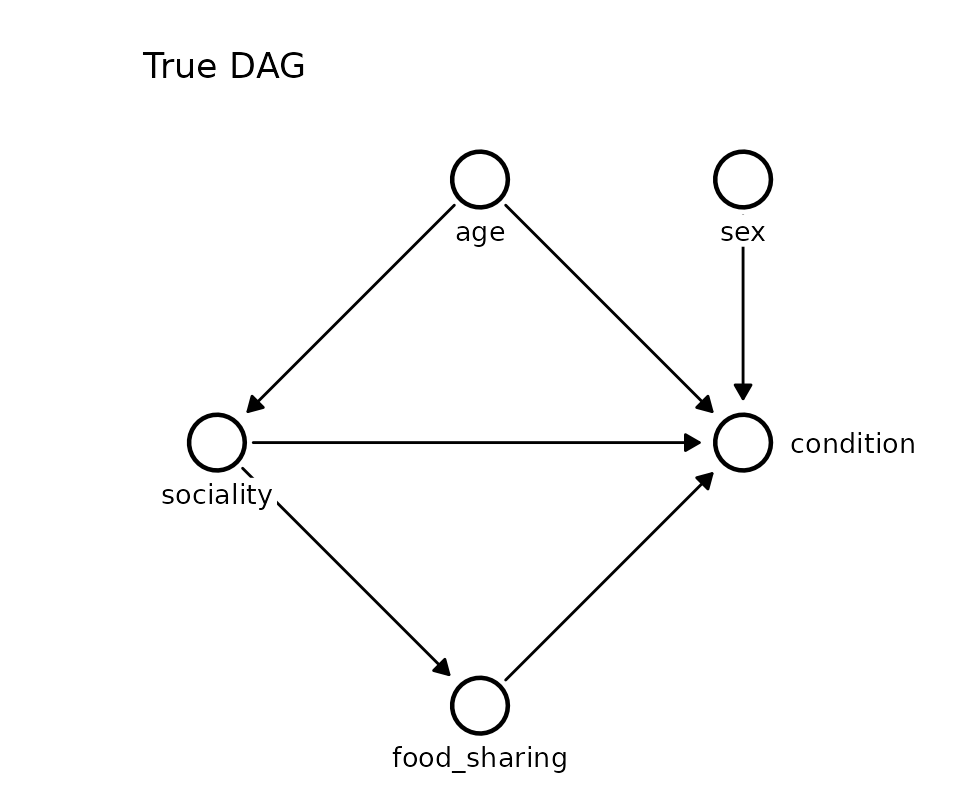
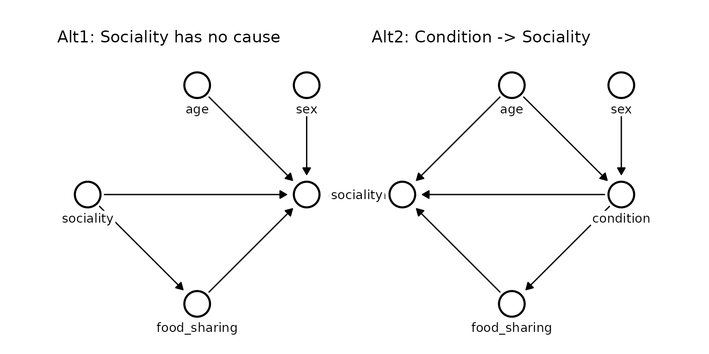
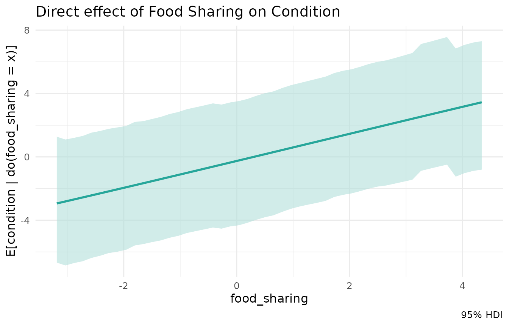
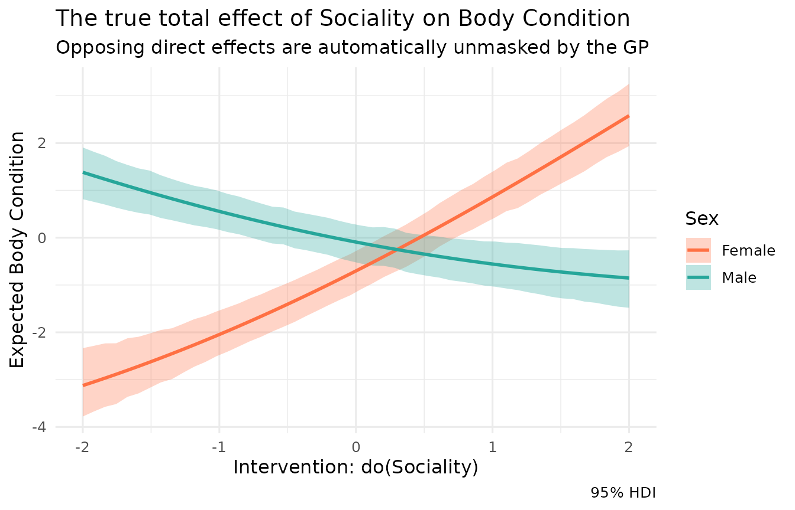

# Case study: Sociality and fitness in ecology

In this vignette, we explore a classic observational study in
behavioural ecology. We’ll use Kagu to perform causal discovery,
estimate effects, unmask hidden interactions, and avoid the notorious
“Table II fallacy” common in traditional regression.

## The study system

Imagine a long-term field study of a social mammal population (e.g.,
macaques, dolphins, or elephants). We have collected observational data
on 50 individuals - a small, noisy field dataset typical of
hard-to-observe wild populations - measuring five variables:

- `age`: Age of the individual (standardised).
- `sex`: Female (`-1`) or Male (`1`).
- `sociality`: A continuous index of social network centrality.
- `food_sharing`: The rate at which the individual participates in
  cooperative food sharing.
- `condition`: Body condition index (e.g., girth-to-length ratio; a
  proxy for fitness).

### The true causal structure

We simulate the data based on expert domain knowledge of the species:

1.  **Age \\\to\\ Sociality**: Older individuals have had more time to
    establish social bonds.
2.  **Age \\\to\\ Condition**: Older individuals are more experienced
    foragers, directly improving their condition independent of
    sociality. This makes `age` a **confounder** of the
    sociality-condition relationship.
3.  **Sociality \\\to\\ Food sharing**: More central individuals share
    food more often.
4.  **Food sharing \\\to\\ Condition**: Receiving shared food directly
    improves caloric intake and body condition. This makes
    `food_sharing` a **mediator** on the path from sociality to
    condition.
5.  **Sex \\\to\\ Condition**: Males and females differ in baseline
    condition due to sexual dimorphism.
6.  **Sociality \\\to\\ Condition (Direct, interacting with Sex)**:
    Sociality also directly affects condition through stress buffering
    (e.g., lower cortisol). However, this effect is highly
    **sex-dependent**. For females, sociality means allomaternal support
    and reduced stress (positive effect). For males, sociality means
    proximity to competitors and higher agonistic stress (negative
    effect).

Let’s simulate 50 individuals from this exact process:

``` r

n <- 50
sex <- sample(c(-1, 1), n, replace = TRUE)
age <- rnorm(n)
# Sociality and food sharing are measured with substantial noise, which is what
# leaves the direction of the sociality -> food_sharing edge genuinely uncertain.
sociality <- 0.5 * age + rnorm(n, sd = 1.5)
food_sharing <- 0.8 * sociality + rnorm(n, sd = 1.5)

# The direct effect of sociality is +1.0 for females (sex = -1) and -1.0 for males (sex = 1)
# We simulate this via the interaction term: -1.0 * sex * sociality
condition <- 0.5 * age + 0.5 * sex + 0.8 * food_sharing - 1.0 * sex * sociality + rnorm(n, sd = 0.5)

df <- data.frame(age, sex, sociality, food_sharing, condition)
```

We can visualise the true proposed causal graph:

``` r

dag_true <- list(
  age          = c(),
  sex          = c(),
  sociality    = "age",
  food_sharing = "sociality",
  condition    = c("age", "sex", "sociality", "food_sharing")
)

# Fix the node positions for visual consistency across plots
node_pos <- list(
  age          = c(1, 1),
  sex          = c(1, 2),
  sociality    = c(2, 0),
  food_sharing = c(3, 1),
  condition    = c(2, 2)
)

kagu_plot_dag(dag_true, node_pos) + ggtitle("True DAG")
```



## Causal Discovery

Before estimating effects, researchers often want to verify their causal
graph against alternative hypotheses.

Suppose a reviewer suggests two alternative models: 1. `Alt1`: Sociality
has no measured cause - the apparent `age → sociality` link is just
noise. 2. `Alt2`: Body condition causes sociality (healthier individuals
have more energy to socialize).

``` r

dag_alt1 <- list(
  age          = c(),
  sex          = c(),
  sociality    = c(),
  food_sharing = "sociality",
  condition    = c("age", "sex", "sociality", "food_sharing")
)

dag_alt2 <- list(
  age          = c(),
  sex          = c(),
  condition    = c("age", "sex"),
  food_sharing = "condition",
  sociality    = c("age", "food_sharing", "condition")
)

library(patchwork)
kagu_plot_dag(dag_alt1, node_pos) + ggtitle("Alt1: Sociality has no cause") +
kagu_plot_dag(dag_alt2, node_pos) + ggtitle("Alt2: Condition -> Sociality")
```



We can use Kagu’s causal discovery engine to score our theoretically
proposed DAG against these alternatives. Kagu evaluates the full joint
marginal likelihood of the non-linear Gaussian Process fits.

``` r

# Pass the specific DAGs to discover over. Naming them means the summary table
# refers to each structure by name; unnamed DAGs get ids "A", "B", "C", ... and
# can be inspected with res$get_dag(id) / res$plot_dag(id).
res <- KaguModel$discover(
  df,
  dags = list("True" = dag_true, "Alt 1" = dag_alt1, "Alt 2" = dag_alt2)
)
res$summary()
#> # A tibble: 3 × 5
#>    rank id    n_edges log_marglik posterior_prob
#>   <int> <chr>   <int>       <dbl>          <dbl>
#> 1     1 True        6       -296.       8.34e- 1
#> 2     2 Alt 1       5       -298.       1.66e- 1
#> 3     3 Alt 2       6       -335.       7.10e-18
```

Kagu places most of the posterior (~83%) on `dag_true`, but crucially it
does **not** claim certainty. `Alt2` - the hypothesis that body
condition *causes* sociality - is decisively rejected (~0%): reversing
those edges contradicts the strong, non-linear signature that `sex`,
`sociality` and `food_sharing` jointly leave in `condition`. But `Alt1`,
which drops the single `age → sociality` edge (claiming sociality has no
measured cause), still retains ~17% of the posterior. With only 50 noisy
individuals the weak influence of age on sociality is genuinely hard to
detect, and Kagu reports that ambiguity honestly rather than papering
over it.

Two things are worth noting. First, the parents of `condition` are
pinned down with near-certainty across every competitive structure - the
strong `sex * sociality` interaction gives the GP a non-linear signature
that no reversal of those edges can mimic. Second, the
posterior-over-DAGs framing carries the residual structural uncertainty
forward rather than discarding it, so we can go on to estimate effects
while remaining appropriately humble about which structure generated the
data.

## The Table II fallacy

Now that we are reasonably confident in the structure, we fit it with
Kagu so we can interrogate the graph directly:

``` r

mod <- KaguModel$new(dag_true)
mod$fit(df)
```

Our primary question is the total effect of `sociality` on `condition`.
Done carefully with a regression, we adjust for the confounder `age`
and, correctly, leave the mediator `food_sharing` out of the model:

``` r

summary(lm(condition ~ sociality + age + sex, data = df))$coefficients
#>                Estimate Std. Error     t value   Pr(>|t|)
#> (Intercept) -0.01925162  0.2589181 -0.07435407 0.94105106
#> sociality    0.10875672  0.1816107  0.59884544 0.55221379
#> age          0.61497785  0.2808704  2.18954307 0.03366777
#> sex          0.39141862  0.2596293  1.50760547 0.13849324
```

This model is correctly specified for the question it was built to
answer. The temptation is then to read *every* row of the table as “the
effect of that variable on condition.” That is the **Table II fallacy**
([Westreich & Greenland, 2013](https://doi.org/10.1093/aje/kws412)): the
coefficients in a single table are not the same kind of quantity.

- **`sociality`** is the estimand the study was designed for – its
  population-average total effect on condition – because we adjusted
  correctly for it.
- **`age`** is *not* age’s total effect. It is age’s effect *holding
  sociality fixed*: the **direct** effect, which throws away age’s
  influence that runs *through* sociality (older animals are more
  social, and sociality feeds condition). Age’s total effect is larger.
- **`sex`** modifies the effect of sociality (the `sex * sociality`
  interaction), so no single “main effect” number for sex can be read as
  “the effect of sex.”

Kagu makes the distinction concrete. Asked for age’s *total* effect, it
propagates through the whole graph, including the
`age → sociality → condition` path:

``` r

mod$effects("age", "condition", hdi = 0.95)$summary()
#> # A tibble: 1 × 8
#>   source target       from    to  mean    sd hdi_lower hdi_upper
#>   <chr>  <chr>       <dbl> <dbl> <dbl> <dbl>     <dbl>     <dbl>
#> 1 age    condition -0.0581 0.942 0.987 0.318     0.435      1.63
```

The total effect (mean \\\approx 1.0\\) is larger than the regression’s
age coefficient (\\\approx 0.6\\): the difference is precisely the
indirect path through sociality that the coefficient leaves out. Same
data, same graph, but a different question and a different answer. With
only 50 individuals both estimates are uncertain, yet the *distinction*
between them is structural, not statistical.

It can be worse still. An adjustment variable with its own unmeasured
confounder gives a coefficient that is not merely the wrong estimand but
outright confounded; Westreich & Greenland give the full taxonomy. The
remedy is the same in every case: decide which estimand you want for
each variable and let the graph deliver it, rather than reading a
regression table as a list of interchangeable “effects” – which is
exactly what Kagu does next.

## Estimating the true effects with Kagu

The model is already fitted, so we can query any estimand we like from
the same graph. Take the one the regression targeted – the total effect
of `sociality` on `condition` – where Kagu adjusts for the confounder
`age` and *integrates out* the mediator `food_sharing` via the
do-operator, carrying the full posterior:

``` r

# The average total effect of a 1-unit increase in sociality
mod$effects("sociality", "condition", hdi = 0.95)$summary()
#> # A tibble: 1 × 8
#>   source    target       from    to  mean    sd hdi_lower hdi_upper
#>   <chr>     <chr>       <dbl> <dbl> <dbl> <dbl>     <dbl>     <dbl>
#> 1 sociality condition -0.0910 0.909 0.384 0.231   -0.0603     0.844
```

The point estimate is modestly positive (~0.38), but the 95% HDI is very
wide and straddles zero. This is not a failure - it is Kagu being
honest. The population-averaged total effect is pulled in two directions
at once: the food-sharing mediation contributes a positive push, while
the *direct* effect of sociality is strongly positive in females and
strongly negative in males, so on average it nearly cancels and mostly
inflates the spread. A single population-averaged number is therefore
almost meaningless here; the wide HDI is Kagu’s way of telling us the
effect is highly heterogeneous across the population. In the next
section we split it apart by sex to reveal exactly what that average
conceals.

### Examining the mediator

We can also easily query multiple different effects from the same fitted
model. For instance, what is the direct effect of our mediator, food
sharing?

``` r

mod$effects("food_sharing", "condition", hdi = 0.95)$summary()
#> # A tibble: 1 × 8
#>   source       target      from    to  mean     sd hdi_lower hdi_upper
#>   <chr>        <chr>      <dbl> <dbl> <dbl>  <dbl>     <dbl>     <dbl>
#> 1 food_sharing condition -0.194 0.806 0.854 0.0920     0.692      1.05
mod$effects("food_sharing", "condition", sweep = TRUE, hdi = 0.95)$plot() +
  ggtitle("Direct effect of Food Sharing on Condition")
```



The model recovers the direct effect of food sharing (\\\approx 0.85\\
here - close to the true value of 0.8, correctly identified as the
strongest single pathway, and the one coefficient the flawed linear
table got roughly right!).

### Unmasking the interaction

Because Kagu models each node as a Gaussian Process, it has already
learned the `sex * sociality` interaction automatically. We can
visualise the true, divergent effects of sociality by using a `sweep`
and passing a list of `conditions`.

``` r

eff_multi <- mod$effects(
  source = "sociality",
  target = "condition",
  sweep = TRUE,
  hdi = 0.95,
  # Sweep over the well-supported central range (sociality has sd ~1.5); going
  # far into the sparse tails just shows the GP reverting to its prior.
  sweep_range = c(-2, 2),
  conditions = list(
    list(sex = -1), # Females
    list(sex =  1)  # Males
  )
)

eff_multi$plot() +
  scale_color_manual(values = c("sex=-1" = "#ff7043", "sex=1" = "#26a69a"),
                     labels = c("Female", "Male")) +
  scale_fill_manual(values = c("sex=-1" = "#ff7043", "sex=1" = "#26a69a"),
                    labels = c("Female", "Male")) +
  labs(
    title = "The true total effect of Sociality on Body Condition",
    subtitle = "Opposing direct effects are automatically unmasked by the GP",
    x = "Intervention: do(Sociality)",
    y = "Expected Body Condition",
    color = "Sex", fill = "Sex"
  )
```



The diverging plot reveals exactly what the classic regression table
hid: sociality has a massive effect on body condition for both sexes.
For females, the stress-buffering benefits of sociality compound with
the food-sharing benefits, resulting in a steep positive slope. For
males, the costs of agonistic competition overwhelm the food-sharing
benefits, resulting in a negative slope.

We can read off the same story quantitatively by querying the
conditional (per-sex) total effect directly:

``` r

mod$effects("sociality", "condition", conditions = list(sex = -1), hdi = 0.95)$summary()  # Females
#> # A tibble: 1 × 8
#>   source    target       from    to  mean    sd hdi_lower hdi_upper
#>   <chr>     <chr>       <dbl> <dbl> <dbl> <dbl>     <dbl>     <dbl>
#> 1 sociality condition -0.0910 0.909  1.44 0.142      1.16      1.71
mod$effects("sociality", "condition", conditions = list(sex =  1), hdi = 0.95)$summary()  # Males
#> # A tibble: 1 × 8
#>   source    target       from    to   mean    sd hdi_lower hdi_upper
#>   <chr>     <chr>       <dbl> <dbl>  <dbl> <dbl>     <dbl>     <dbl>
#> 1 sociality condition -0.0910 0.909 -0.572 0.121    -0.789    -0.329
```

For females the effect is strongly positive (\\\approx 1.4\\), for males
strongly negative (\\\approx -0.6\\) - two large, opposing effects that
the population-averaged estimate above (and the linear regression table)
washed out to near zero.

## Why classic model selection fails

To drive this point home, let’s see what happens if a researcher
realizes their basic linear model was inadequate and attempts to rely
purely on data-driven model selection (like step-wise AIC) to find the
“best” model for `condition`.

``` r

# Try all possible main effects and 2-way interactions
full_model <- lm(condition ~ (age + sex + sociality + food_sharing)^2, data = df)

# Use step-wise AIC to find the best model
best_lm <- step(full_model, trace = FALSE)

summary(best_lm)$coefficients
#>                           Estimate Std. Error    t value     Pr(>|t|)
#> (Intercept)            -0.10518871 0.06828718  -1.540387 1.307935e-01
#> age                     0.60368934 0.06888731   8.763433 4.044857e-11
#> sex                     0.29804661 0.06231479   4.782920 2.054145e-05
#> sociality              -0.05597326 0.05490741  -1.019412 3.137090e-01
#> food_sharing            0.82411489 0.04782411  17.232205 6.380261e-21
#> sex:sociality          -1.02705168 0.04593807 -22.357312 2.653017e-25
#> sociality:food_sharing  0.05055655 0.01948286   2.594925 1.288911e-02
```

Even though the AIC algorithm successfully detected the strong
`sex:sociality` interaction and correctly rejected the simpler linear
models, the coefficients from this “best” model are deeply misleading
for causal inference:

1.  Because `food_sharing` (the mediator) was retained as a predictor by
    the AIC algorithm, the base `sociality` coefficient (\\\approx
    -0.06\\) is entirely stripped of its indirect pathway.
2.  If the researcher takes the `food_sharing` coefficient (\\\approx
    0.82\\) and treats it as the causal effect of food sharing, they are
    committing the **Table II Fallacy**. The variables chosen by AIC to
    optimally predict `condition` are fundamentally not the correct
    adjustment set for estimating the causal effect of `food_sharing`.

Kagu avoids all of this by explicitly separating the *causal structure*
(the DAG) from the *functional form* (the GPs). It discovers the
interactions automatically to identify the structure, and then
rigorously applies Do-calculus to estimate the exact marginal or
conditional effects without falling into the Table II trap!
