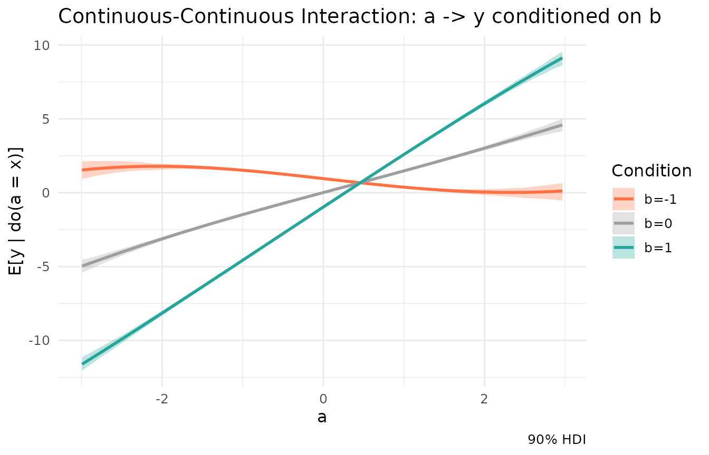

# Modelling interactions

In traditional linear modelling (`lm`), interactions between variables
must be explicitly specified by the researcher (e.g., `y ~ a * b`). If
you forget to include the interaction term, the model is forced to
assume that the effect of `a` is strictly independent of `b`, leading to
biased or incomplete estimates.

Kagu takes a different approach. Because Kagu models each node as a
Gaussian Process over an eigen-basis of its parents, **interactions are
learned automatically**. The GP naturally spans the multi-dimensional
surface of its inputs, capturing non-linearities and interactions
without any explicit formula from the user.

In this vignette, we’ll look at how to recover and visualise a
continuous-continuous interaction using Kagu’s effect estimation.

## A system with a strong interaction

Let’s simulate a system where $`A`$ and $`B`$ are independent causes of
$`Y`$, but they interact multiplicatively. The true data-generating
process is:
``` math
 Y = 1.5 A - 1.0 B + 2.0 (A \times B) + \epsilon 
```

Because of the positive $`2.0`$ interaction term, the effect of $`A`$ on
$`Y`$ heavily depends on the value of $`B`$. If $`B`$ is positive, $`A`$
has a strong positive effect. If $`B`$ is negative, $`A`$’s effect might
even become negative!

``` r

n <- 500
a <- rnorm(n)
b <- rnorm(n)
y <- 1.5 * a - 1.0 * b + 2.0 * (a * b) + rnorm(n, sd = 0.5)

df <- data.frame(a, b, y)
```

We define our Kagu model as usual and fit it. Notice that we do *not*
tell Kagu about the interaction.

``` r

dag <- list(
  a = c(),
  b = c(),
  y = c("a", "b")
)

mod <- KaguModel$new(dag)
mod$fit(df)
```

## The marginal effect

If we ask Kagu for the effect of `a` on `y` without specifying anything
else, it integrates out the uncertainty and natural distribution of `b`
over the dataset.

``` r

# The average marginal gradient of a -> y
mod$effects("a", "y")$summary()
#> # A tibble: 1 × 8
#>   source target    from    to  mean    sd hdi_lower hdi_upper
#>   <chr>  <chr>    <dbl> <dbl> <dbl> <dbl>     <dbl>     <dbl>
#> 1 a      y      -0.0300 0.970  1.41 0.108      1.25      1.59
```

The average effect is positive (around 1.5), which matches the main
effect of `a` in our simulation. However, the standard deviation/HDI is
quite wide. That’s because the “true” effect of `a` is not a single
number-it’s highly variable depending on `b`.

## Conditioning to reveal the interaction

To probe the interaction, we can estimate the effect of `a` on `y` while
**conditioning** `b` at specific values using the `conditions` argument.

Let’s look at the gradient (the local slope) of `a -> y` when
$`B = -1`$, $`B = 0`$, and $`B = 1`$:

``` r

# Slope when b = -1
mod$effects("a", "y", conditions = list(b = -1))$summary()
#> # A tibble: 1 × 8
#>   source target    from    to   mean     sd hdi_lower hdi_upper
#>   <chr>  <chr>    <dbl> <dbl>  <dbl>  <dbl>     <dbl>     <dbl>
#> 1 a      y      -0.0300 0.970 -0.621 0.0526    -0.709    -0.537

# Slope when b = 0
mod$effects("a", "y", conditions = list(b = 0))$summary()
#> # A tibble: 1 × 8
#>   source target    from    to  mean     sd hdi_lower hdi_upper
#>   <chr>  <chr>    <dbl> <dbl> <dbl>  <dbl>     <dbl>     <dbl>
#> 1 a      y      -0.0300 0.970  1.46 0.0437      1.39      1.53

# Slope when b = 1
mod$effects("a", "y", conditions = list(b = 1))$summary()
#> # A tibble: 1 × 8
#>   source target    from    to  mean     sd hdi_lower hdi_upper
#>   <chr>  <chr>    <dbl> <dbl> <dbl>  <dbl>     <dbl>     <dbl>
#> 1 a      y      -0.0300 0.970  3.59 0.0466      3.52      3.68
```

The model successfully recovered the interaction! \* At $`B = -1`$, the
expected slope is $`1.5 + 2.0(-1) = -0.5`$. Kagu estimates
$`\approx -0.5`$. \* At $`B = 0`$, the expected slope is
$`1.5 + 2.0(0) = 1.5`$. Kagu estimates $`\approx 1.5`$. \* At $`B = 1`$,
the expected slope is $`1.5 + 2.0(1) = 3.5`$. Kagu estimates
$`\approx 3.5`$.

## Visualising the interaction with sweeps

We can visualise this interactive surface by requesting `sweep = TRUE`.
Rather than computing the effects one at a time and combining them
manually, we can pass a list of conditions directly to `$effects()`.

Kagu will automatically compute the sweep under each condition, bundle
them together, and overlay them seamlessly when you call `$plot()`!

``` r

# Request full sweeps of a -> y at different levels of b
eff_multi <- mod$effects("a", "y", sweep = TRUE, conditions = list(
  list(b = -1),
  list(b = 0),
  list(b = 1)
))

# Plot the interaction seamlessly
eff_multi$plot() +
  scale_color_manual(values = c("b=-1" = "#ff7043", "b=0" = "#9e9e9e", "b=1" = "#26a69a")) +
  scale_fill_manual(values = c("b=-1" = "#ff7043", "b=0" = "#9e9e9e", "b=1" = "#26a69a")) +
  ggtitle("Continuous-Continuous Interaction: a -> y conditioned on b")
```



The diverging slopes clearly show the interaction effect.

By treating causal mechanisms as flexible Gaussian Processes, Kagu frees
you from having to guess or pre-specify the exact functional form of
your causal relationships. Interactions are automatically detected,
naturally accommodated, and easily visualised using the `conditions`
argument!
