# Prior and posterior predictive checks

A fitted model is only as trustworthy as its assumptions. The Bayesian
workflow of Gelman et al. (2020) and Gabry et al. (2019) checks those
assumptions by **simulating data from the model and comparing it with
the data you have**:

- A **prior predictive check** simulates data from the priors alone,
  before seeing the outcome. Does the model think plausible data looks
  plausible, or does it expect values that are absurd?
- A **posterior predictive check** simulates *replicated* data `yrep`
  from the fitted model. If the model captures the process that
  generated `y`, then `y` should look like a typical draw of `yrep`.
  Systematic differences point to what the model is missing.

A graphical causal model adds a twist to the usual workflow: you can
check it at two levels. Each **mechanism** (a node given its parents)
can fit well or badly, and the **graph** as a whole makes claims - every
missing edge implies a conditional independence - that the data may
contradict. Kagu supports both, and returns replicates in the format the
[bayesplot](https://mc-stan.org/bayesplot/) package expects, so you can
use its full set of `ppc_*()` plots.

``` r

library(kagu)
library(ggplot2)
library(bayesplot)
color_scheme_set("teal")
```

## An example system

We use a small, arbitrary system with four variables. `x` and `w` are
root causes; `z` depends non-linearly on `x`; and `y` depends on `z` and
`w`, including an interaction between them.

``` r

set.seed(2024)
n <- 150
x <- rnorm(n)
w <- rnorm(n)
z <- sin(2 * x) + 0.5 * x + rnorm(n, sd = 0.3)
y <- 0.8 * z + 0.6 * w + 0.5 * z * w + rnorm(n, sd = 0.4)
d <- data.frame(x, w, z, y)

dag <- list(x = c(), w = c(), z = "x", y = c("z", "w"))
```

``` r

node_pos <- list(x = c(1, 1), z = c(1, 2), w = c(2, 1), y = c(2, 2))
kagu_plot_dag(dag, node_pos)
```

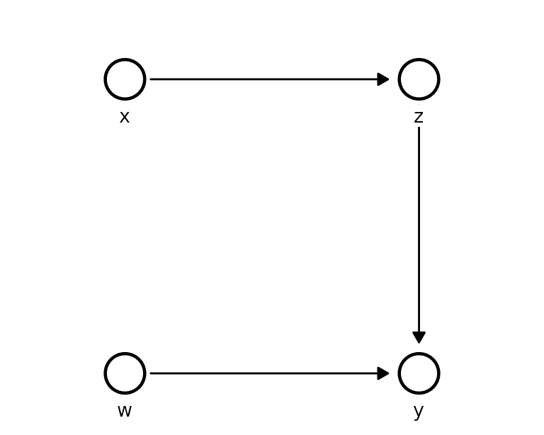

## Prior predictive checks

Each Kagu node is a Gaussian process whose behaviour is controlled by
three hyperparameters, all on the **standardised** scale (each variable
centred and scaled to unit sd before fitting):

- a **lengthscale** per parent - how far the parent must move before the
  function changes (small = wiggly);
- a **signal sd** - how much the function varies;
- a **noise sd** - how much the node scatters around the function.

Kagu fits these by optimisation, but optimisation implies a prior: by
default the search is confined to a wide box, which is the same as a
log-uniform prior over that box.
[`gp_prior()`](https://causalabs.github.io/kagu-r/reference/gp_prior.md)
makes it explicit:

``` r

gp_prior()
#> <kagu_gp_prior> (standardised scale)
#>   lengthscale  loguniform(lower = 0.04979, upper = 54.6)
#>   signal_sd    loguniform(lower = 0.1353, upper = 7.389)
#>   noise_sd     loguniform(lower = 0.04979, upper = 2.718)
#>   root_mean    normal(mean = 0, sd = 1)
#>   root_sd      lognormal(meanlog = 0, sdlog = 0.5)
```

### What does the default prior believe?

Priors on hyperparameters are hard to judge directly. It is much easier
to look at what they imply for the *data*. First, draw functions for `z`
against `x` from the prior, and overlay the observed data:

``` r

prior_model <- KaguModel$new(dag)

plot_functions <- function(draws, title) {
  ggplot(draws, aes(parent_value, value, group = draw)) +
    geom_line(colour = "#26a69a", alpha = 0.35) +
    geom_point(data = d, aes(x, z), inherit.aes = FALSE, size = 0.7) +
    labs(x = "x", y = "z", title = title) +
    theme_minimal()
}

plot_functions(
  prior_model$function_draws("z", "x", ndraws = 40, prior = TRUE, data = d),
  "Prior function draws: default prior"
)
```

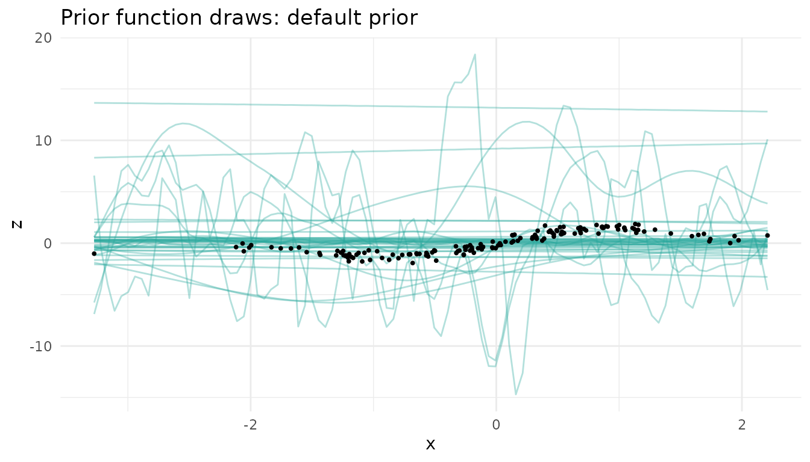

The default prior is happy with functions that swing many times the
range of the data, and with ones that oscillate over a tiny fraction of
`x`. Next, simulate whole datasets from the prior, ancestrally through
the graph, and compare them with the observed `y`:

``` r

pr_default <- prior_model$prior_predictive(d, ndraws = 100)

bayesplot_grid(
  ppc_dens_overlay(pr_default$y("y"), pr_default$yrep("y")[1:50, ]),
  ppc_stat(pr_default$y("y"), pr_default$yrep("y"), stat = "sd"),
  grid_args = list(ncol = 2)
)
```

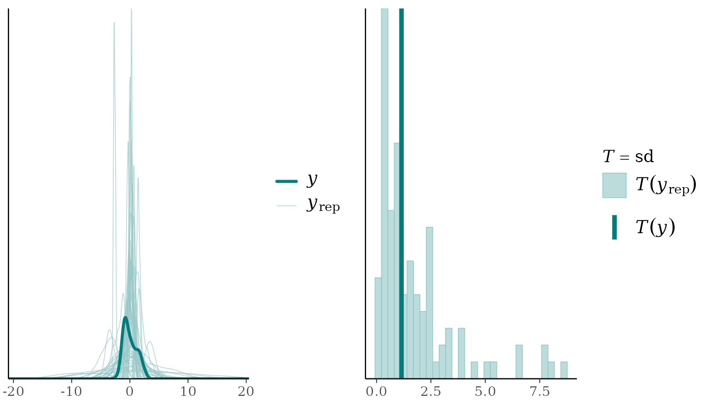

The prior predictive spread of `y` ranges over more than an order of
magnitude (sd from 0.08 to 8.6, against an observed 1.15). This prior is
not “uninformative” - it actively favours data far more extreme than
anything we would expect.

Note that the priors live on the standardised scale, so each variable’s
location and scale are anchored to the observed data (as in rstanarm’s
autoscaling). The prior predictive check is therefore about shape,
spread and smoothness, not about where the data are centred.

### A weakly informative prior

On the standardised scale, sensible defaults are easy to reason about:

- `lengthscale = prior_lognormal(0, 0.5)` - functions change over
  roughly 0.4 to 2.7 sd of a parent: smooth, but able to bend;
- `signal_sd = prior_halfnormal(1)` - the function varies on the scale
  of the data, not ten times it;
- `noise_sd = prior_halfnormal(0.5)` - the noise is at most around the
  scale of the data.

``` r

wi_prior <- gp_prior(
  lengthscale = prior_lognormal(0, 0.5),
  signal_sd   = prior_halfnormal(1),
  noise_sd    = prior_halfnormal(0.5)
)
wi_mechanism <- GPMechanism$new(prior = wi_prior)
wi_mechanism$hyper   # a non-default prior is fitted by MAP, so it is actually used
#> [1] "map"

wi_model <- KaguModel$new(dag, default_mechanism = wi_mechanism)

plot_functions(
  wi_model$function_draws("z", "x", ndraws = 40, prior = TRUE, data = d),
  "Prior function draws: weakly informative prior"
)
```

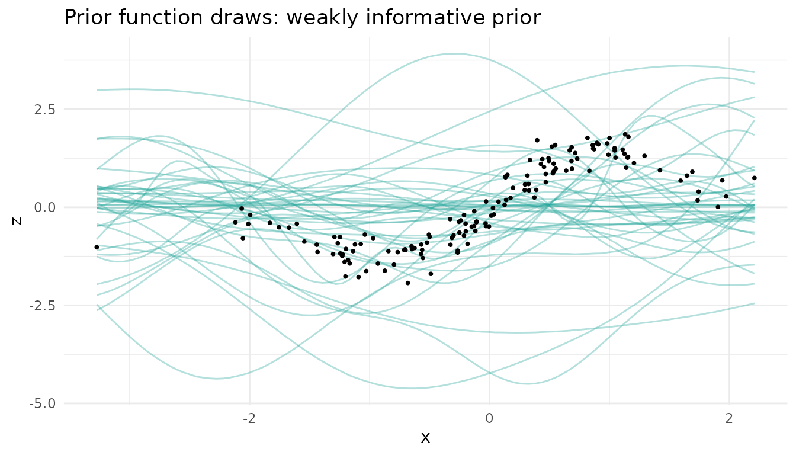

``` r

pr_wi <- wi_model$prior_predictive(d, ndraws = 100)

bayesplot_grid(
  ppc_dens_overlay(pr_wi$y("y"), pr_wi$yrep("y")[1:50, ]),
  ppc_stat(pr_wi$y("y"), pr_wi$yrep("y"), stat = "sd"),
  grid_args = list(ncol = 2)
)
```

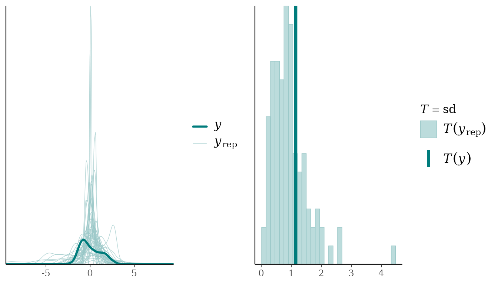

The prior predictive datasets now sit on the same scale as the data,
while still allowing a wide range of shapes. The observed data look like
one plausible draw.

### Does the choice matter?

With 150 observations the data dominate either prior. Fitting both
models and comparing a causal effect is a quick sensitivity check:

``` r

default_model <- KaguModel$new(dag)
default_model$fit(d)
wi_model$fit(d)

rbind(
  cbind(prior = "default (ML)", default_model$effects("x", "y", hdi = 0.95)$summary()),
  cbind(prior = "weakly informative (MAP)", wi_model$effects("x", "y", hdi = 0.95)$summary())
)[, c("prior", "mean", "hdi_lower", "hdi_upper")]
#>                      prior     mean hdi_lower hdi_upper
#> 1             default (ML) 2.514723  2.015332  3.107309
#> 2 weakly informative (MAP) 2.579754  2.154849  3.075798
```

The estimates barely move, so the conclusions are not an artefact of the
prior. With less data, or more parents per node, the weakly informative
prior matters more: it keeps the fit from chasing noise. We use
`wi_model` from here on.

## Posterior predictive checks

### Checking each mechanism

`type = "conditional"` (the default) simulates every node given its
*observed* parents, so it checks each mechanism on its own:

``` r

pc <- wi_model$posterior_predictive(ndraws = 100)
pc
#> <PredictiveResult [conditional]: 4 nodes, 100 replicated datasets of n = 150>
#>   Use $y(node) / $yrep(node) with bayesplot::ppc_*(), or $summary().

bayesplot_grid(
  ppc_dens_overlay(pc$y("z"), pc$yrep("z")[1:50, ]) + ggtitle("z | x"),
  ppc_dens_overlay(pc$y("y"), pc$yrep("y")[1:50, ]) + ggtitle("y | z, w"),
  grid_args = list(ncol = 2)
)
```

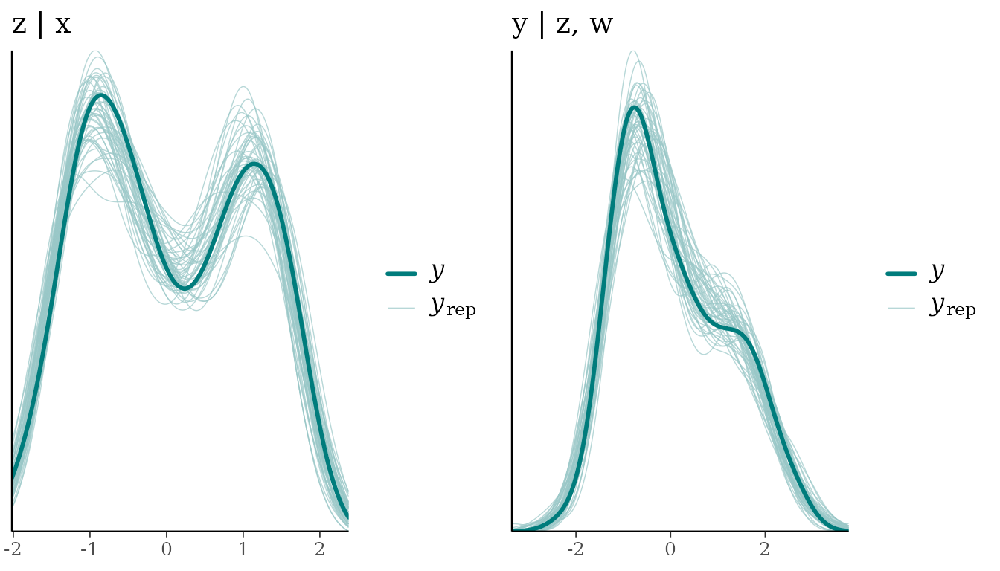

The replicated densities (light) surround the observed one (dark).
Summary statistics give the same check numerically: `p_value` is the
share of replicated datasets whose statistic is at least the observed
one, so values near 0 or 1 signal a mismatch.

``` r

pc$summary(stats = c("mean", "sd", "min", "max"), nodes = c("z", "y"))
#> # A tibble: 8 × 7
#>   node  stat  observed rep_mean rep_lower rep_upper p_value
#>   <chr> <chr>    <dbl>    <dbl>     <dbl>     <dbl>   <dbl>
#> 1 z     mean    0.0418   0.0401  -0.0109      0.100    0.47
#> 2 z     sd      1.05     1.05     1.00        1.10     0.53
#> 3 z     min    -1.93    -1.81    -2.01       -1.62     0.84
#> 4 z     max     1.86     2.01     1.77        2.34     0.79
#> 5 y     mean    0.0570   0.0569  -0.00730     0.126    0.49
#> 6 y     sd      1.15     1.15     1.09        1.23     0.46
#> 7 y     min    -2.27    -2.19    -2.67       -1.83     0.63
#> 8 y     max     2.69     2.97     2.58        3.36     0.89
```

These posterior predictive p-values are not classical p-values: they are
not uniform even when the model is right (they cluster around 0.5), so
treat them as a descriptive flag rather than a test.

### Checks that target the structure

A density overlay is a blunt instrument. Gabry et al. (2019) recommend
choosing checks that probe what the model could plausibly get wrong, and
in a causal graph the parents of each node tell you where to look. Here,
`y` should move with `w`. Plotting the observed `y` against `w`, with
the replicated intervals, checks exactly that:

``` r

ppc_intervals(pc$y("y"), pc$yrep("y"), x = d$w) +
  labs(x = "w", y = "y", title = "y against w: observed (dark) vs replicated intervals")
```

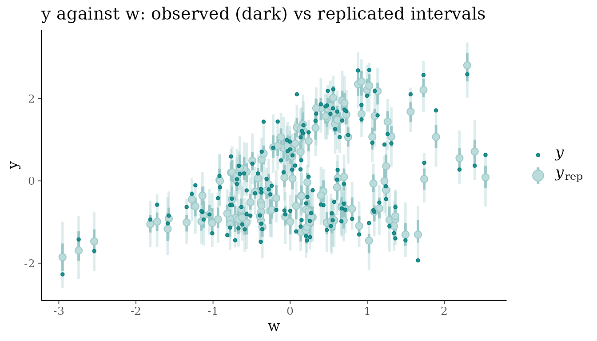

Equivalently, split the data by `w` and compare the mean of `y` within
each group:

``` r

w_group <- cut(d$w, quantile(d$w, 0:3 / 3), include.lowest = TRUE,
               labels = c("low w", "mid w", "high w"))

ppc_stat_grouped(pc$y("y"), pc$yrep("y"), group = w_group, stat = "mean")
```

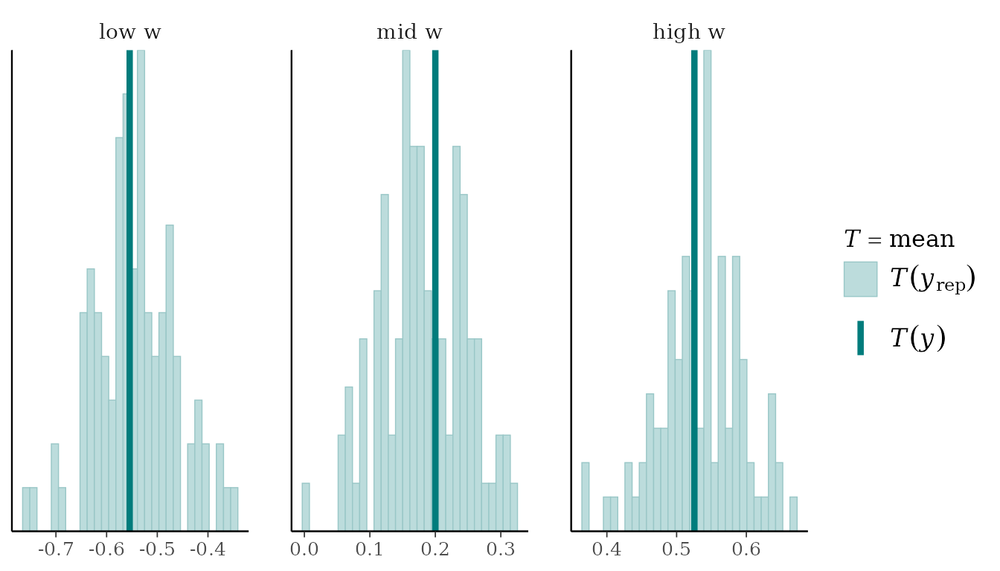

### Checking the graph as a whole

`type = "joint"` instead simulates the whole graph from the fitted
model: root nodes from their marginals, every other node from its
mechanism given its *simulated* parents. Each replicated dataset then
carries every dependence the DAG implies, so we can compare the
correlation of every pair of variables with what the model reproduces:

``` r

pj <- wi_model$posterior_predictive(ndraws = 100, type = "joint")
pj$plot_cor(prob = 0.95)
```

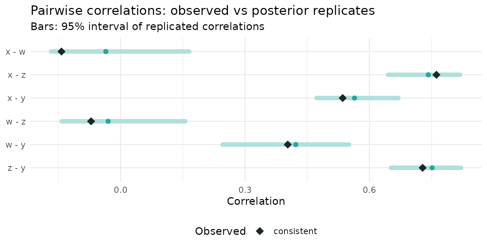

Every pair lies within its replicated range.

## Catching a misspecified model

Now suppose we had drawn the graph without the `w -> y` edge:

``` r

dag_bad <- list(x = c(), w = c(), z = "x", y = "z")

bad_model <- KaguModel$new(dag_bad, default_mechanism = GPMechanism$new(prior = wi_prior))
bad_model$fit(d)
pc_bad <- bad_model$posterior_predictive(ndraws = 100)
```

The standard marginal checks of `y` look fine. The missing influence of
`w` is simply absorbed into a larger noise term, so the overall
distribution is still reproduced:

``` r

ppc_dens_overlay(pc_bad$y("y"), pc_bad$yrep("y")[1:50, ])
```

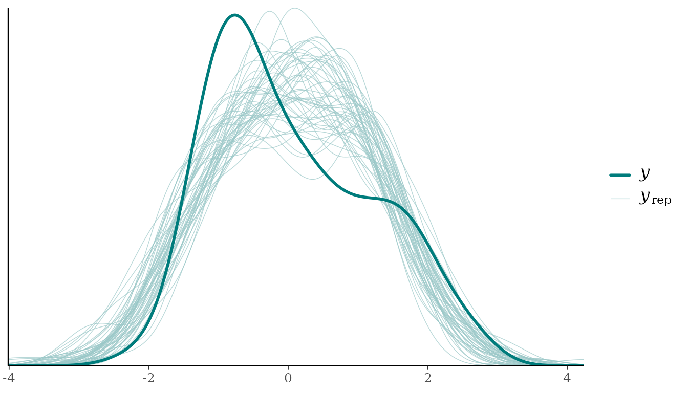

``` r

pc_bad$summary(nodes = "y")
#> # A tibble: 4 × 7
#>   node  stat  observed rep_mean rep_lower rep_upper p_value
#>   <chr> <chr>    <dbl>    <dbl>     <dbl>     <dbl>   <dbl>
#> 1 y     mean    0.0570   0.0533    -0.106     0.187    0.48
#> 2 y     sd      1.15     1.15       1.04      1.30     0.46
#> 3 y     min    -2.27    -2.76      -3.37     -2.23     0.08
#> 4 y     max     2.69     2.79       2.18      3.50     0.6
```

A model can pass every one of these checks and still be wrong. The
structural checks, however, fail clearly. The replicated `y` no longer
changes with `w`, while the observed `y` does:

``` r

ppc_intervals(pc_bad$y("y"), pc_bad$yrep("y"), x = d$w) +
  labs(x = "w", y = "y", title = "Misspecified model: y against w")
```

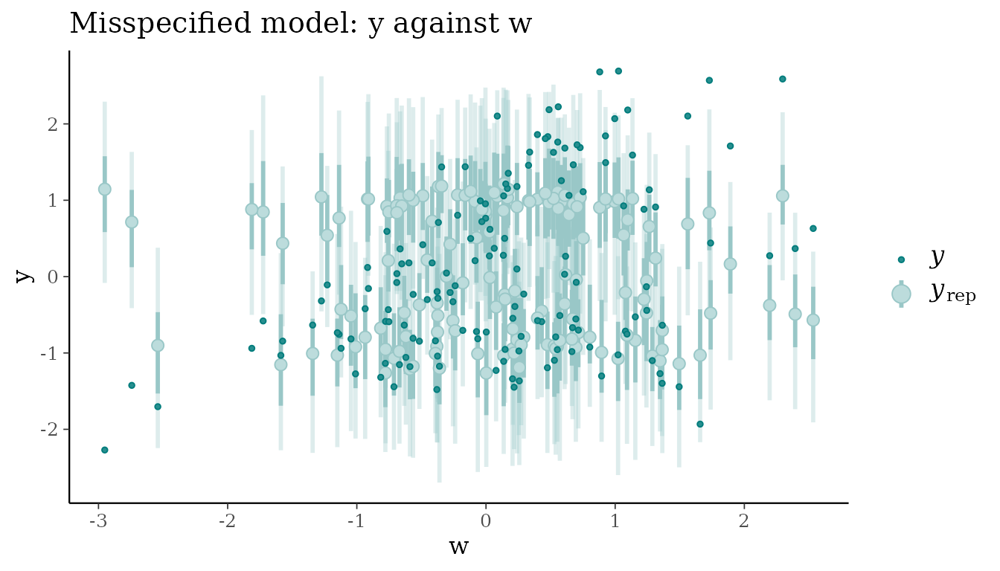

``` r


ppc_stat_grouped(pc_bad$y("y"), pc_bad$yrep("y"), group = w_group, stat = "mean")
```

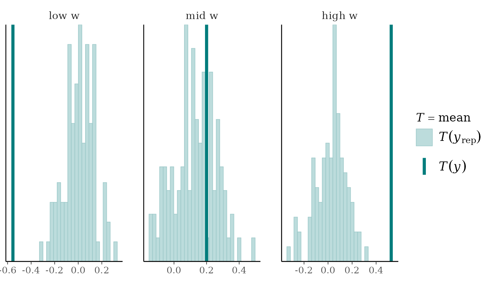

The graph-level check finds the same problem without our having to guess
where to look. The DAG claims `w` and `y` are independent, the
replicated data obey that claim, and the observed data do not:

``` r

pj_bad <- bad_model$posterior_predictive(ndraws = 100, type = "joint")
pj_bad$plot_cor(prob = 0.95)
```

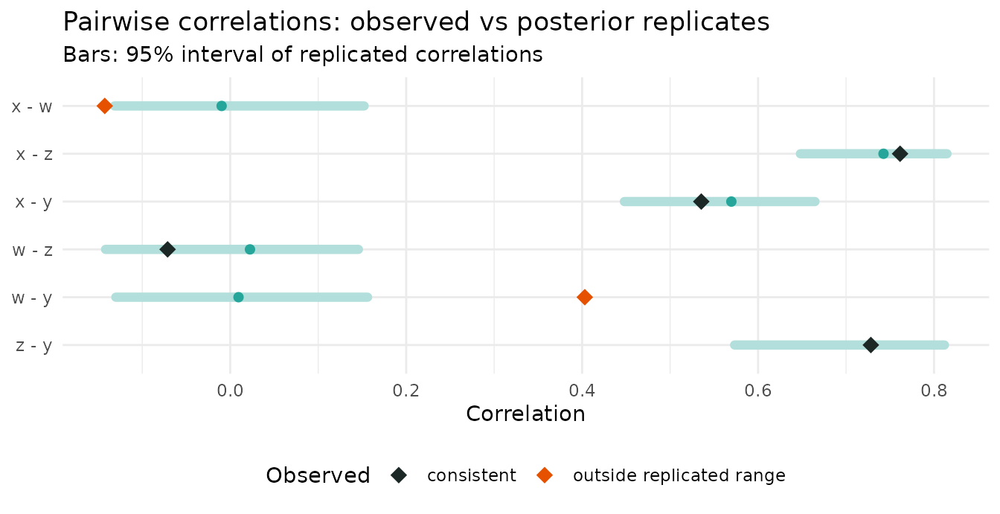

The observed correlation between `w` and `y` is 0.4, against a
replicated 95% range of -0.13 to 0.16. Every missing edge in a DAG is a
testable claim of (conditional) independence, and joint replicates are a
direct way to test those claims.

## Checking versus discovery

Kagu’s structure discovery
([`vignette("discovery")`](https://causalabs.github.io/kagu-r/articles/discovery.md))
also judges graphs, but it answers a *relative* question: which of the
candidate DAGs is best supported? Predictive checks answer an *absolute*
one: is this model adequate? The two are complementary. Discovery can
confidently prefer the best of a set of candidates that are all wrong,
and only a check against the data will reveal it.

## Summary

1.  **Before fitting**, check the prior: `$function_draws(prior = TRUE)`
    and `$prior_predictive()`. Replace the vague default with a weakly
    informative
    [`gp_prior()`](https://causalabs.github.io/kagu-r/reference/gp_prior.md)
    if it implies implausible data.
2.  **After fitting**, check each mechanism with
    `$posterior_predictive(type = "conditional")`. Go beyond density
    overlays: plot each node against its parents, and use statistics
    that target what could be wrong.
3.  **Check the graph** with `$posterior_predictive(type = "joint")` and
    `$plot_cor()`, which tests the independences the DAG implies.

Two caveats apply. Kagu’s hyperparameters are point estimates, so the
replicates do not include hyperparameter uncertainty and can be slightly
too narrow. And posterior predictive checks use the data twice (once to
fit, once to check), which makes them conservative: they are good at
revealing gross misfit, less so at subtle problems.

## References

- Gabry, J., Simpson, D., Vehtari, A., Betancourt, M. & Gelman, A.
  (2019). Visualization in Bayesian workflow. *Journal of the Royal
  Statistical Society: Series A*, 182(2), 389-402.
  <https://doi.org/10.1111/rssa.12378>
- Gelman, A., Meng, X.-L. & Stern, H. (1996). Posterior predictive
  assessment of model fitness via realized discrepancies. *Statistica
  Sinica*, 6, 733-807.
- Gelman, A., Vehtari, A., Simpson, D., et al. (2020). Bayesian
  workflow. <https://arxiv.org/abs/2011.01808>
