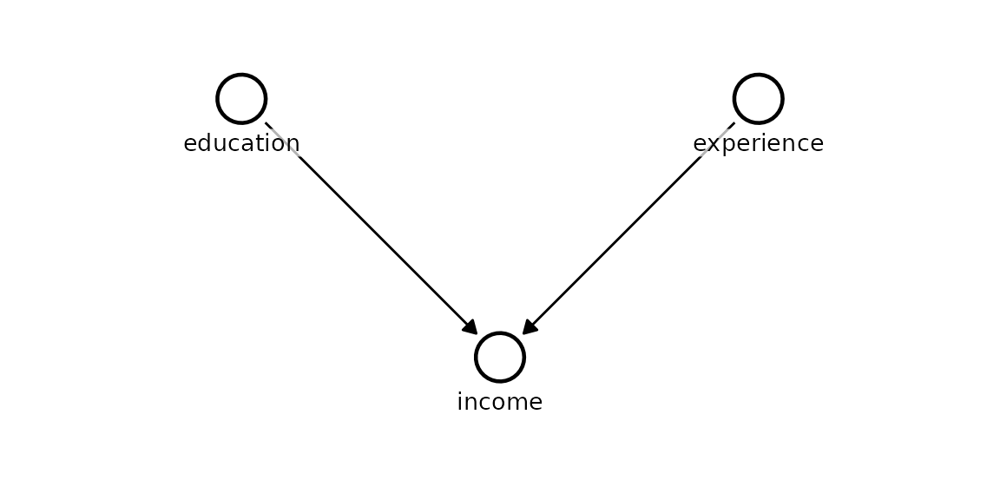
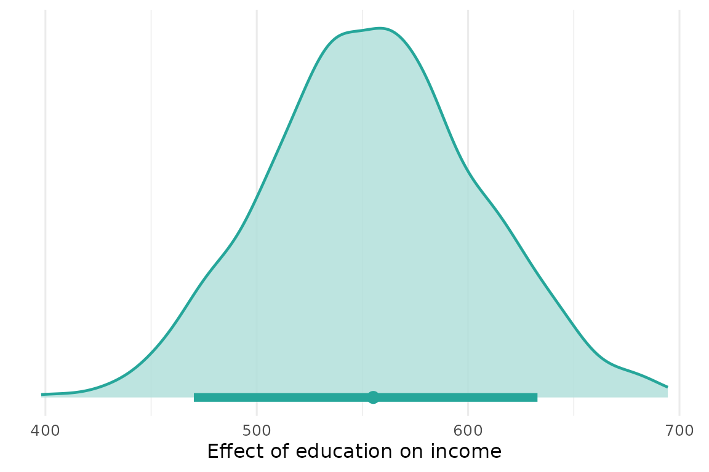
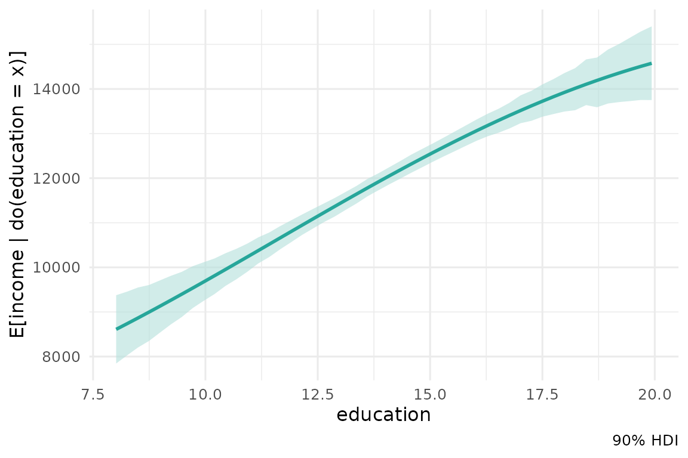

# Quickstart

This quickstart fits a small causal model end to end: define the graph,
fit it, and read off causal effects with full posterior uncertainty.

## Define the causal structure

A Kagu model is a DAG - a named list mapping each node to its parent
nodes. Here `income` is caused by both `education` and `experience`,
which have no parents of their own (they are *root* nodes, written as
[`c()`](https://rdrr.io/r/base/c.html)).

``` r

dag <- list(
  education = c(),
  experience = c(),
  income = c("education", "experience")
)

model <- KaguModel$new(dag = dag)

# node_pos gives each node a c(row, col) grid coordinate (row increases
# downward, col rightward) so the layout renders predictably.
model$plot_dag(node_pos = list(
  education  = c(0, -1),
  experience = c(0,  1),
  income     = c(1,  0)
))
```



The arrows encode our causal assumptions: an arrow `A → B` means “A is a
direct cause of B”. Everything Kagu computes is relative to this
structure, so it pays to get it right.

## Simulate data and fit

We generate data in which each extra year of education adds £500 to
income and each year of experience adds £200, then fit the model. Each
node’s conditional distribution is modelled as a Gaussian process of its
parents, so the fit adapts to whatever shape the relationship takes.

``` r

N          <- 500
education  <- rnorm(N, 14, 2)
experience <- rnorm(N, 10, 5)
income     <- 3000 + 500 * education + 200 * experience + rnorm(N, sd = 2000)

data <- data.frame(
  education  = education,
  experience = experience,
  income     = income
)
```

``` r

model$fit(data)
```

## Causal effects

The default
[`effects()`](https://causalabs.github.io/kagu-r/reference/effects.md)
call returns the **local causal effect at the mean** - the instantaneous
slope of `target` with respect to `source`, holding the intervention
central. For a linear mechanism this is directly comparable to a
regression coefficient, and here it recovers the data-generating value
of ≈ 500.

``` r

effect <- model$effects("education", "income")
effect$summary()
#> # A tibble: 1 × 8
#>   source    target  from    to  mean    sd hdi_lower hdi_upper
#>   <chr>     <chr>  <dbl> <dbl> <dbl> <dbl>     <dbl>     <dbl>
#> 1 education income  13.9  14.9  555.  49.7      470.      633.
```

The summary is a tidy tibble. Reading the columns:

- `from` / `to` - the two intervention values being contrasted.
- `mean` - the posterior mean effect (our point estimate).
- `sd` - the posterior standard deviation (how uncertain that estimate
  is).
- `hdi_lower` / `hdi_upper` - the bounds of the 90% **highest density
  interval** (HDI): the narrowest interval containing 90% of the
  posterior probability. It is the Bayesian analogue of a confidence
  interval, but with the interpretation people usually *want*: there is
  a 90% probability the effect lies inside it, given the model and data.
  When the HDI excludes 0, the effect is credibly non-zero in that
  direction.

### Standardised effect

`std_units = TRUE` reports the effect of a **one standard-deviation**
increase in the cause, centred at its mean. This puts effects of
variables measured on different scales onto a common footing for
comparison.

``` r

effect_sd <- model$effects("education", "income", std_units = TRUE)
effect_sd$summary()
#> # A tibble: 1 × 8
#>   source    target  from    to  mean    sd hdi_lower hdi_upper
#>   <chr>     <chr>  <dbl> <dbl> <dbl> <dbl>     <dbl>     <dbl>
#> 1 education income  13.0  14.9 1076.  95.8      914.     1230.
```

### Explicit contrast

Pass `values = c(from, to)` to ask a concrete counterfactual question.
Here: how much more would someone with 16 years of education earn than
someone with 12, all else flowing through the causal model?

``` r

effect_contrast <- model$effects("education", "income", values = c(12, 16))
effect_contrast$summary()
#> # A tibble: 1 × 8
#>   source    target  from    to  mean    sd hdi_lower hdi_upper
#>   <chr>     <chr>  <dbl> <dbl> <dbl> <dbl>     <dbl>     <dbl>
#> 1 education income    12    16 2189.  192.     1874.     2506.
```

The mean is roughly four times the unit effect, as expected for a
four-year gap under a linear mechanism.

### Visualising the posterior

[`plot()`](https://rdrr.io/r/graphics/plot.default.html) shows the full
posterior distribution of the effect - the point is the mean and the bar
beneath is the HDI. The spread *is* the uncertainty.

``` r

effect$plot()
```



## Dose-response curve

A sweep traces the expected outcome across a grid of intervention
values, `E[income | do(education = x)]`, with an HDI ribbon. This is the
interventional dose-response curve: what we expect income to be if we
*set* education to each value.

``` r

sweep <- model$effects("education", "income", sweep = TRUE)
sweep$plot()
```



## Model summary

[`summary()`](https://causalabs.github.io/kagu-r/reference/summary.md)
returns a table across every node. For each parent it reports the
**direct local effect** - the gradient of the node’s fitted function
with respect to that parent, evaluated at the parents’ means. For a
linear relationship this is exactly the slope, so here `education` and
`experience` recover ≈ 500 and ≈ 200. Each node also gets a
`sigma (noise)` row for its residual scale, and everything carries a
posterior mean, sd, and HDI.

``` r

model$summary()
#> # A tibble: 5 × 6
#>   node       term             mean      sd hdi_lower hdi_upper
#>   <chr>      <chr>           <dbl>   <dbl>     <dbl>     <dbl>
#> 1 education  sigma (noise)    1.95  0.0637      1.86      2.07
#> 2 experience sigma (noise)    5.17  0.169       4.92      5.46
#> 3 income     sigma (noise) 1936.   61.7      1832.     2035.  
#> 4 income     education      555.   49.7       470.      633.  
#> 5 income     experience     218.   19.0       186.      246.
```

## Diagnostics

`diagnostics()` reports the posterior draw count and residual noise per
node. (The Gaussian-process posterior is available in closed form as a
single sample, so the chain-based r-hat / ESS diagnostics of MCMC do not
apply.)

``` r

model$diagnostics("income")
#> # A tibble: 1 × 5
#>   node   n_chains n_draws sigma sigma_sd
#>   <chr>     <int>   <int> <dbl>    <dbl>
#> 1 income        1    1000 1935.     59.6
```

## Save and load

A fitted model (optionally with its data) round-trips to disk, so you
can refit once and query effects later.

``` r

tmp <- tempfile(fileext = ".rds")
model$save(tmp)
loaded <- KaguModel$load(tmp)
loaded$effects("education", "income")$summary()
#> # A tibble: 1 × 8
#>   source    target  from    to  mean    sd hdi_lower hdi_upper
#>   <chr>     <chr>  <dbl> <dbl> <dbl> <dbl>     <dbl>     <dbl>
#> 1 education income  13.9  14.9  555.  49.7      470.      633.
```
